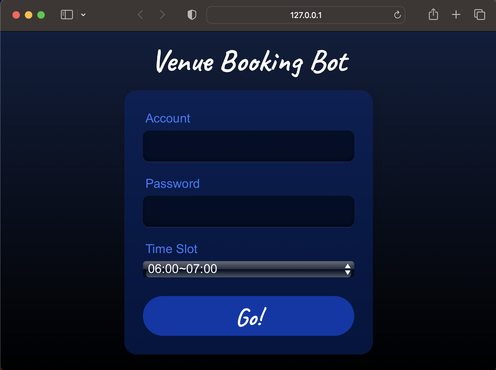

This project automates the process of booking venues using a Python script for the automation logic.



# Project Setup
## Option 1: Set Up the Python Environment

### Prerequisites

- Python 3.x
- pip (Python package installer)
- PyInstaller (for packaging the Python script)
- Flask

### Step 1: Set Up the Python Environment
Create and activate a virtual environment:

```bash
python3 -m venv bot_env
source bot_env/bin/activate
```

Install the required Python packages:
```bash
pip install Flask
pip install git+https://github.com/g1879/DrissionPage.git
pip install pyinstaller
```

### Step 2: Package the Python Script
Use PyInstaller to package the Python script into a standalone executable:

```bash
pyinstaller --onefile --noupx --add-data "templates:templates" --add-data "static:static" --hidden-import "sdk" app.py
```
This will create a dist directory with the packaged executable (app or app.exe).

# Project Structure
```
venue-booking-bot
├── dist
│   └── app           
├── templates          
│   └── index.html     
├── static             
│   └── style.css      
├── app.py             
├── sdk.py             
└── README.md          

```

# Files

`app.py`
This is the main Python script containing the Flask application and automation logic. It uses the DrissionPage library to interact with the website and handles user input via the web interface.

`sdk.py`
This script contains the logic for the booking SDK. It includes methods for logging in, trying to book, and other related functionalities.

`templates/index.html`
This is the HTML file that defines the user interface for the application. It uses Flask to render the interface.

`static/styles.css`
This file contains the CSS styling for the user interface.


# Configuration
Ensure the path to the Python executable is correct in your setup and that the script logic in main.py and sdk.py is correct for your booking needs.

# Usage
1. Fill in the account and password fields.
2. Select the desired time slot from the dropdown menu.
3. Click the "Submit" button to start the booking process.

# Running the Application
```
cd dist
./app
```
Alternatively, you can run the Flask application directly using the Python script:
```
python3 app.py
```

# Troubleshooting
f you encounter issues with the Python script not being found, ensure the path is correct and that the Python script has been packaged correctly with PyInstaller.

If you encounter other issues, check the Flask application logs for error messages and ensure all dependencies are installed correctly.

# Note for macOS Users
This documentation and setup instructions are specifically tailored for macOS users. Ensure that you follow the steps closely and use the appropriate commands for creating virtual environments, installing dependencies, and packaging the application. If you are running this project on Windows, make sure to adjust the commands and paths accordingly.